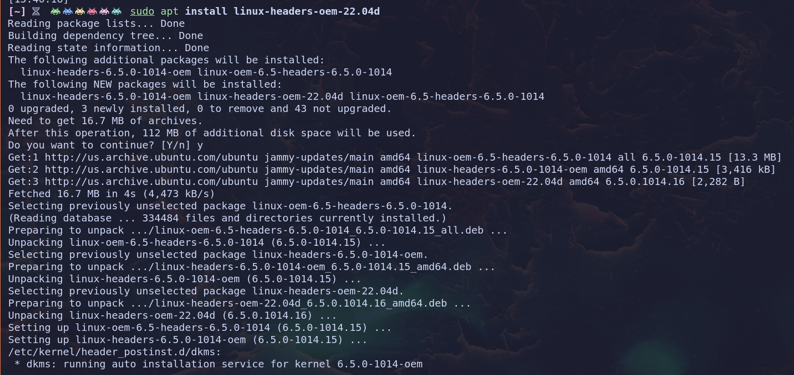
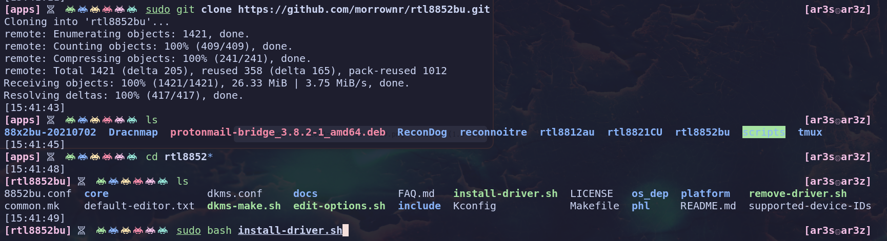
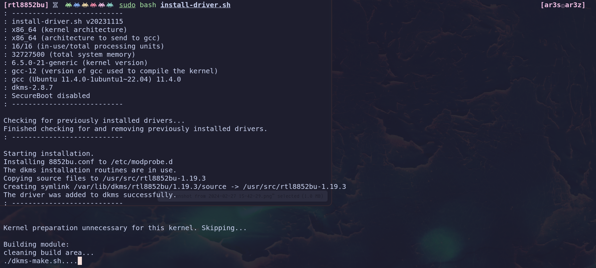
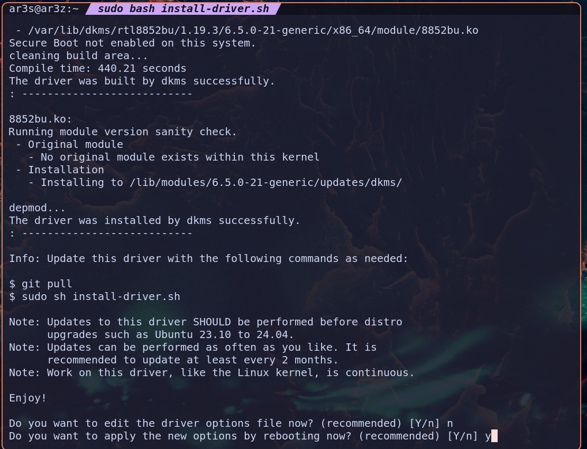
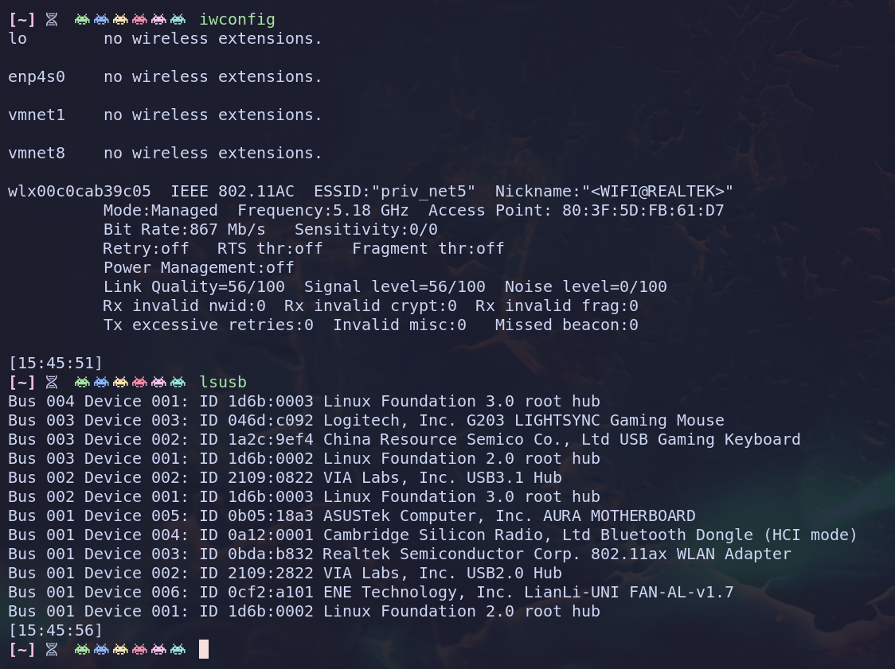

▙▄ █☰ ▜▛ ▟▛  █ ▛▟ ▟▛ ▜▛ ▞▚ ▙▄ ▙▄  ▟▛ ██ ▛▚▞▜ █☰  ◗ 🆁 █ ▚▞ █☰ 🆁 ▟▛ ❢ 

█▄─▄███▄─▄▄─█─▄─▄─█─▄▄▄▄███▄─▄█▄─▀█▄─▄█─▄▄▄▄█─▄─▄─██▀▄─██▄─▄███▄─▄█████─▄▄▄▄█─▄▄─█▄─▀█▀─▄█▄─▄▄─█
██─██▀██─▄█▀███─███▄▄▄▄─████─███─█▄▀─██▄▄▄▄─███─████─▀─███─██▀██─██▀███▄▄▄▄─█─██─██─█▄█─███─▄█▀█
▀▄▄▄▄▄▀▄▄▄▄▄▀▀▄▄▄▀▀▄▄▄▄▄▀▀▀▄▄▄▀▄▄▄▀▀▄▄▀▄▄▄▄▄▀▀▄▄▄▀▀▄▄▀▄▄▀▄▄▄▄▄▀▄▄▄▄▄▀▀▀▄▄▄▄▄▀▄▄▄▄▀▄▄▄▀▄▄▄▀▄▄▄▄▄▀

█▄─▄▄▀█▄─▄▄▀█▄─▄█▄─█─▄█▄─▄▄─█▄─▄▄▀█─▄▄▄▄█
██─██─██─▄─▄██─███▄▀▄███─▄█▀██─▄─▄█▄▄▄▄─█
▀▄▄▄▄▀▀▄▄▀▄▄▀▄▄▄▀▀▀▄▀▀▀▄▄▄▄▄▀▄▄▀▄▄▀▄▄▄▄▄▀

So you've got your new Alfa 36AX or otherwise new RTL8832 or 8852 chipset based dongle and now your linux distro won't pick it up...lets fix that!
Firstly we're going to need to install proper linux-headers package for your distro.  In our case we're using Ubuntu 22.04 on the 6.5 Kernel, so lets grab them.


```sudo apt search headers```

In my case I needed these :
 

```sudo apt-get install linux-headers-oem-22.04d```

Let that finish up and lets grab our tested and working driver

```sudo git clone https://github.com/morrownr/rtl8852bu```

```cd rtl8852bu```

```sudo bash install-driver.sh```





At the end you'll be prompted to edit config file which I've found isn't needed either in a VM or on metal.



At which you will need to restart to get a working result!




███████████████████████████████████████
█▄─▄█████▄─▄███▄─▀█▄─▄███▄─█─▄███─▄▄▄▄█
██─██▀████─█████─█▄▀─█████─▄▀████▄▄▄▄─█
▀▄▄▄▄▄▀▀▀▄▄▄▀▀▀▄▄▄▀▀▄▄▀▀▀▄▄▀▄▄▀▀▀▄▄▄▄▄▀
